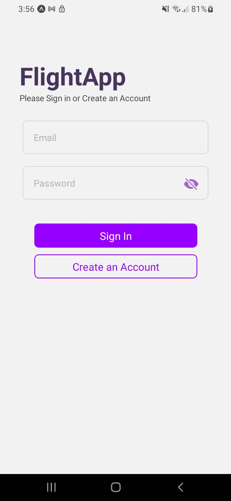
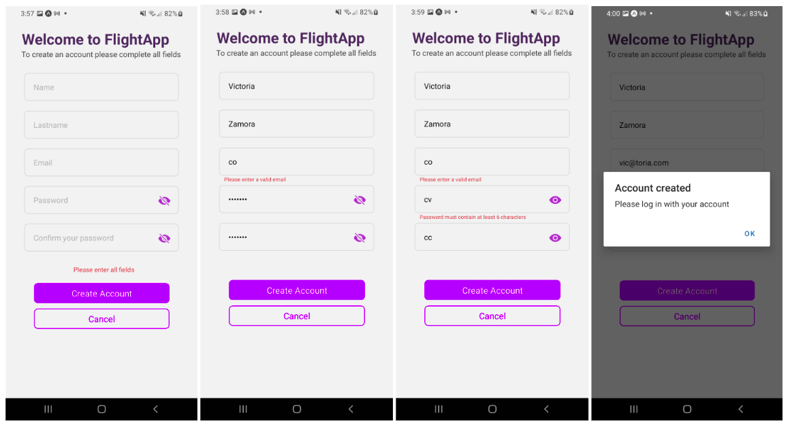
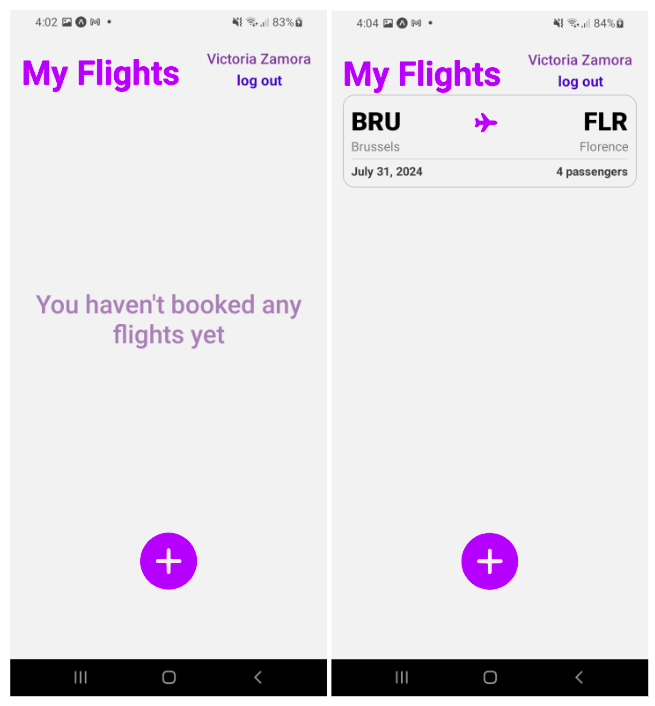
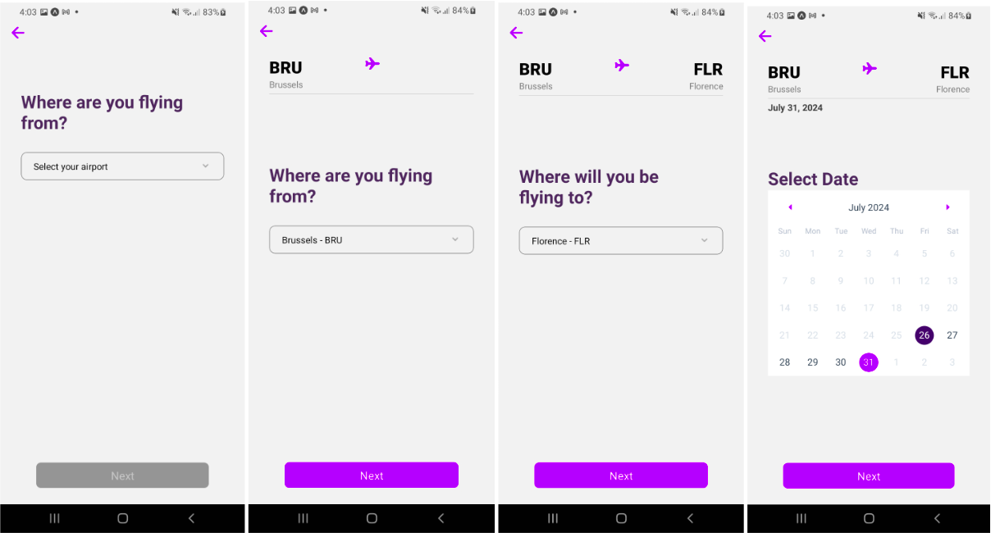
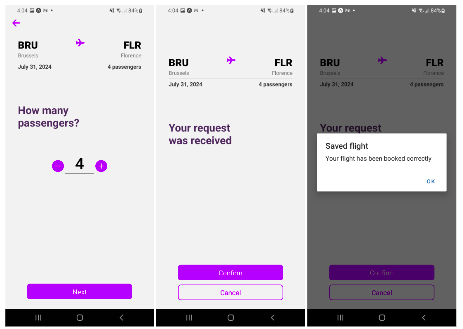
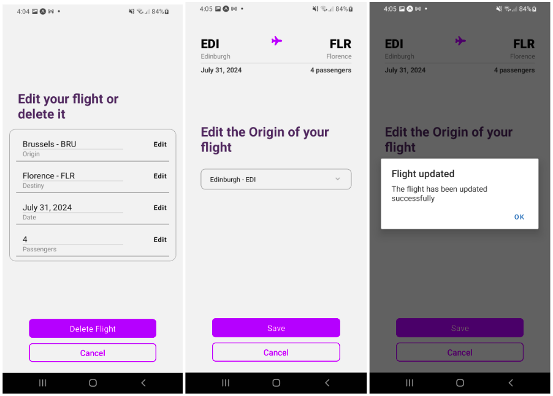
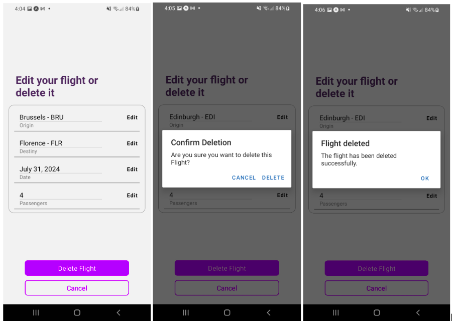

# Flight App Backend
# Getting Started

This mobile application is built with a MySQL database and allows users to create flights by selecting the origin and destination from a local database, specifying the date, and indicating the number of passengers.

The app also supports user account creation, enabling individuals to log in and maintain a personalized list of flights associated with their account. This ensures that each user has access to their own unique flight history and bookings.

## Authors

- [@Diana-Camz](https://www.github.com/octokatherine)


## Installation

You can clone this repository 
```bash
  git@github.com:Diana-Camz/flightApp_backend.git
```
Run the backend server with
```bash
  npm run dev
```
And run the frontend application with
```bash
  npx expo start
```

## Configure environment variables
Clone .env.template file to .env and add your environment variables

## Technologies used
- **React Native Expo**: For creating the mobile application.
- **React Navigation**: For navigation between screens.
- **AsyncStorage**: Provides persistent local storage for saving user login data and preferences.
- **dotenv**: For managing environment variables.
- **Express.js**: Manages HTTP requests and routes.
- **MySQL**: Stores user and flight data.
- **JWT**: Secure user authentication with JSON Web Tokens.
- **bcryptjs**: Encrypts and compares passwords.

## Screenshots







